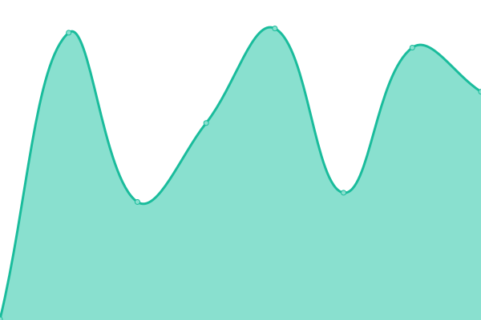
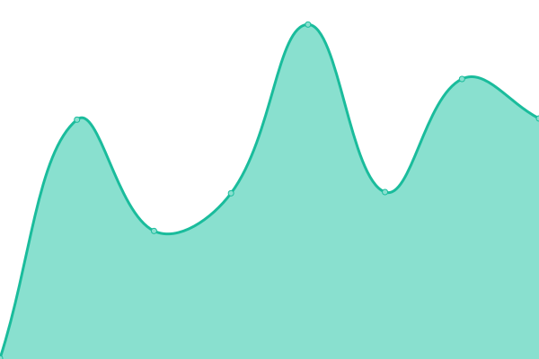

# [📈 Live Status](https://status.nnaf.org): <!--live status--> **🟩 All systems operational**

This repository contains the open-source uptime monitor and status page for [National Network of Abortion Funds](https://abortionfunds.org), powered by [Upptime](https://github.com/upptime/upptime).

With [Upptime](https://upptime.js.org), you can get your own unlimited and free uptime monitor and status page, powered entirely by a GitHub repository. We use [Issues](https://github.com/AbortionFunds/nnaf-status/issues) as incident reports, [Actions](https://github.com/AbortionFunds/nnaf-status/actions) as uptime monitors, and [Pages](https://status.nnaf.org) for the status page.

<!--start: status pages-->
<!-- This summary is generated by Upptime (https://github.com/upptime/upptime) -->
<!-- Do not edit this manually, your changes will be overwritten -->
<!-- prettier-ignore -->
| URL | Status | History | Response Time | Uptime |
| --- | ------ | ------- | ------------- | ------ |
|  [NNAF main website](https://abortionfunds.org) | 🟩 Up | [nnaf-main-website.yml](https://github.com/AbortionFunds/nnaf-status/commits/HEAD/history/nnaf-main-website.yml) | 

 241ms
     
 | 

<a href="https://status.nnaf.org/history/nnaf-main-website">100.00%</a>
    

|  [NNAF sandbox website](https://sandbox.abortionfunds.org) | 🟩 Up | [nnaf-sandbox-website.yml](https://github.com/AbortionFunds/nnaf-status/commits/HEAD/history/nnaf-sandbox-website.yml) | 

 692ms
     
 | 

<a href="https://status.nnaf.org/history/nnaf-sandbox-website">100.00%</a>
    

|  NNAF API | 🟩 Up | [nnaf-api.yml](https://github.com/AbortionFunds/nnaf-status/commits/HEAD/history/nnaf-api.yml) | 

 266ms
     
 | 

<a href="https://status.nnaf.org/history/nnaf-api">100.00%</a>
    

|  [One Time Secret](https://ots.nnaf.org) | 🟩 Up | [one-time-secret.yml](https://github.com/AbortionFunds/nnaf-status/commits/HEAD/history/one-time-secret.yml) | 

 269ms
     
 | 

<a href="https://status.nnaf.org/history/one-time-secret">100.00%</a>
    

|  [YOURLS](https://nnaf.org/admin) | 🟩 Up | [yourls.yml](https://github.com/AbortionFunds/nnaf-status/commits/HEAD/history/yourls.yml) | 

 372ms
     
 | 

<a href="https://status.nnaf.org/history/yourls">100.00%</a>
    

<!--end: status pages-->

[**Visit our status website →**](https://status.nnaf.org)

## 📄 License

- Powered by: [Upptime](https://github.com/upptime/upptime)
- Code: [MIT](./LICENSE) © [National Network of Abortion Funds](https://abortionfunds.org)
- Data in the `./history` directory: [Open Database License](https://opendatacommons.org/licenses/odbl/1-0/)
